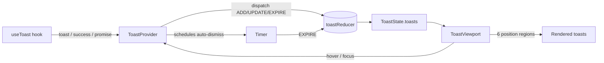

<div align="center">


# react-toast-notifications

**Accessible, headless toast notifications for React — positions, variants, action buttons, and promise toasts, in strict TypeScript.**

_Built and maintained by Viprasol Tech_

[](https://github.com/Viprasol-Tech/react-toast-notifications/actions/workflows/ci.yml)
[](LICENSE)
[](https://www.npmjs.com/package/react-toast-notifications)
[](https://www.typescriptlang.org/)
[](https://react.dev/)
[](#-testing)
[](#-why)

</div>

---

## ✨ Features

- 📍 **Six positions** — anchor toasts to any corner or edge (`top-left`, `top-center`, `top-right`, `bottom-left`, `bottom-center`, `bottom-right`), globally or per toast.
- 🎨 **Semantic variants** — `success`, `error`, `info`, `warning`, and `loading` helpers for one-line calls.
- 🔘 **Action buttons** — attach an `Undo` / `Retry` button with full control over whether the click dismisses.
- ⏳ **Promise toasts** — `promise(p, { loading, success, error })` walks a single toast through a promise lifecycle and resolves with the promise's own value.
- 🖱️ **Pause-on-hover** — timers freeze on hover **and** keyboard focus, then resume with the exact remaining time.
- 🧱 **Max-stack cap** — the oldest toast is dropped automatically once the cap is reached.
- 🧹 **Dismiss-all** — clear everything, or only a single position.
- ♻️ **In-place updates** — `update(id, patch)` and id reuse patch a toast instead of duplicating it.
- ♿ **Accessible** — `role="alert"` / `aria-live="assertive"` for errors and warnings, `role="status"` / `aria-live="polite"` otherwise; toasts are focusable.
- 🧪 **Injectable timer** — swap the clock for deterministic fake-timer tests.
- 🪶 **Headless & zero-dep** — bring your own styles; ship `<ToastViewport>` or render from `useToast().toasts`.
- 🔒 **Strict TypeScript** — fully typed public API, zero `any`.

## 📦 Install

```bash
npm install react-toast-notifications
# or
pnpm add react-toast-notifications
# or
yarn add react-toast-notifications
```

> React 18+ and React DOM are peer dependencies.

## 🚀 Usage

Wrap your app once, then call `useToast()` anywhere beneath it:

```tsx
import {
  ToastProvider,
  ToastViewport,
  useToast,
} from "react-toast-notifications";

function SaveButton() {
  const { success, error, promise } = useToast();

  async function save() {
    // Variant helper
    success("Profile saved!", { duration: 3000 });

    // Promise toast: loading -> success / error, all in one toast
    await promise(api.save(), {
      loading: "Saving...",
      success: (res) => `Saved as ${res.name}`,
      error: (e) => `Could not save: ${String(e)}`,
    });

    // Action button
    error("Upload failed", {
      action: { label: "Retry", onClick: () => save() },
    });
  }

  return <button onClick={save}>Save</button>;
}

export default function App() {
  return (
    <ToastProvider maxVisible={4} defaultPosition="top-right" pauseOnHover>
      <SaveButton />
      {/* Drop-in renderer — or build your own from useToast().toasts */}
      <ToastViewport />
    </ToastProvider>
  );
}
```

### Per-toast position and sticky toasts

```tsx
const { info, toast } = useToast();

info("Saved to bottom-left", { position: "bottom-left" });

// duration: 0 -> sticky (never auto-dismisses)
toast("Click x to close me", { duration: 0 });
```

### Headless rendering

Skip `<ToastViewport>` entirely and render however you like:

```tsx
const { toasts, dismiss } = useToast();

return (
  <>
    {toasts.map((t) => (
      <MyToast key={t.id} {...t} onClose={() => dismiss(t.id)} />
    ))}
  </>
);
```

## 🧭 Architecture



State lives in a **pure reducer** so queue, cap, expiry, and pause/resume logic are unit-testable without React. Auto-dismiss runs through an **injectable timer**, making behavior deterministic under fake timers.

## 📚 API

### `<ToastProvider>` props

| Prop              | Type            | Default       | Description                                             |
| ----------------- | --------------- | ------------- | ------------------------------------------------------ |
| `children`        | `ReactNode`     | —             | Your app.                                              |
| `maxVisible`      | `number`        | `4`           | Hard cap on retained toasts; oldest are dropped.       |
| `defaultDuration` | `number`        | `4000`        | Auto-dismiss ms when a toast omits one (`0` = sticky). |
| `defaultPosition` | `ToastPosition` | `"top-right"` | Default anchor for toasts.                             |
| `pauseOnHover`    | `boolean`       | `true`        | Whether hover/focus pauses timers by default.          |
| `timer`           | `Timer`         | global clock  | Injectable scheduler for deterministic tests.          |

### `useToast()` return value

| Member                                   | Signature                                               | Description                                       |
| ---------------------------------------- | ------------------------------------------------------- | ------------------------------------------------- |
| `toasts`                                 | `Toast[]`                                               | Live list, oldest first.                          |
| `toast(message, options?)`               | `=> string`                                             | Enqueue a toast; returns its id.                  |
| `success` / `error` / `info` / `warning` | `(message, options?) => string`                         | Variant shortcuts.                                |
| `loading(message, options?)`             | `=> string`                                             | Sticky `loading` toast (duration defaults to `0`).|
| `promise(p, messages, options?)`         | `<T>(Promise<T>, PromiseMessages<T>, ...) => Promise<T>`| Loading → success/error in one toast; re-throws.  |
| `update(id, patch)`                      | `=> void`                                               | Patch an existing toast in place.                 |
| `dismiss(id)`                            | `=> void`                                               | Remove a toast by id.                             |
| `clear(position?)`                       | `=> void`                                               | Remove all toasts, or only those at a position.   |

### `ToastOptions`

| Field          | Type            | Description                                                |
| -------------- | --------------- | --------------------------------------------------------- |
| `type`         | `ToastType`     | `info` \| `success` \| `warning` \| `error` \| `loading`. |
| `duration`     | `number`        | Auto-dismiss ms; `0` (or negative) = sticky.              |
| `position`     | `ToastPosition` | One of the six anchors. Overrides the provider default.   |
| `action`       | `ToastAction`   | `{ label, onClick(id), dismissOnClick? }`.                |
| `title`        | `string`        | Bold title rendered above the message.                    |
| `pauseOnHover` | `boolean`       | Override the provider hover-pause behavior for this toast. |
| `id`           | `string`        | Reuse an id to update an existing toast instead of adding. |
| `icon`         | `ReactNode`     | Optional icon node rendered before the content.           |

### `<ToastViewport>` props

| Prop           | Type                                | Description                                        |
| -------------- | ----------------------------------- | -------------------------------------------------- |
| `className`    | `string`                            | Class applied to each position container.          |
| `classNameFor` | `(position) => string \| undefined` | Per-position class resolver (e.g. fixed corners).  |
| `label`        | `string`                            | Accessible region label. Defaults `Notifications`. |

## 🧠 Why

Most toast libraries ship opinionated styles you end up fighting. `react-toast-notifications` keeps the **logic** (queueing, positions, timers, promise lifecycles, accessibility) and leaves the **look** to you — with a pure reducer you can test in isolation and a drop-in viewport for when you just want it to work.

## 🗺️ Roadmap

- [x] Six positions + per-toast override
- [x] Variant helpers + `loading` type
- [x] Action buttons
- [x] Promise toasts
- [x] Pause-on-hover (mouse + keyboard)
- [x] Max-stack + scoped dismiss-all
- [ ] Built-in enter/exit animations (opt-in)
- [ ] Swipe-to-dismiss on touch devices
- [ ] `richColors` themeable preset stylesheet
- [ ] Server-action / RSC friendly helpers

## 🧪 Testing

```bash
npm install
npm run typecheck   # tsc --noEmit, zero errors
npm test            # vitest run, 48 tests
```

The reducer is tested in isolation; the provider and viewport are tested with `@testing-library/react`, fake timers, and real promise flows.

## ❔ FAQ

**Does it ship CSS?** No. It is headless — style the `data-toast-*` attributes (`data-toast-type`, `data-toast-viewport`, `data-toast-paused`) or render your own UI from `useToast().toasts`.

**How do I make a toast sticky?** Pass `duration: 0` (the default for `loading` toasts).

**Can two calls update the same toast?** Yes — pass a stable `id`. A second `toast(msg, { id })` updates the existing toast in place, which is exactly how `promise()` works internally.

**Is it accessible?** Errors and warnings announce assertively (`role="alert"`), others politely (`role="status"`), and toasts are focusable so keyboard users can pause and dismiss them.

## 🤝 Contributing

Contributions are welcome! Please open an issue to discuss substantial changes first. Before sending a PR, run `npm run typecheck` and `npm test` and keep the public API strictly typed (no `any`, no stubs). See [CONTRIBUTING.md](CONTRIBUTING.md) and our [Code of Conduct](CODE_OF_CONDUCT.md).

## Contact — Viprasol Tech Private Limited

- Website: [viprasol.com](https://viprasol.com)
- Email: [support@viprasol.com](mailto:support@viprasol.com)
- Telegram: [t.me/viprasol_help](https://t.me/viprasol_help) | WhatsApp: +91 96336 52112
- GitHub: [@Viprasol-Tech](https://github.com/Viprasol-Tech) | [LinkedIn](https://www.linkedin.com/in/viprasol/) | X [@viprasol](https://twitter.com/viprasol)

## License

[MIT](LICENSE) (c) 2025 Viprasol Tech Private Limited
